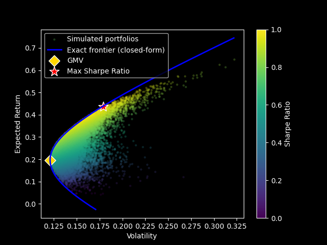

# Efficient Frontier: Monte Carlo Simulation vs. Modern Portfolio Theory

## Introduction

In this repo, I examine one of the common optimization approaches as a
learning exercise: using Monte Carlo simulation to find the portfolio
weighting with the highest Sharpe ratio — that is, the portfolio with the
best risk-reward trade-off. I then compare the simulation result to the
actual efficient frontier, calculated using Modern Portfolio Theory.

For my set of six S&P 500 assets, the simulation results align cleanly with
the theoretical frontier:



Each dot is the result of the simulated portfolio.The blue line is the exact frontier (closed-form solution), the gold diamond
is the Global Minimum Variance (GMV) portfolio, and the red star is the
simulated portfolio with the highest Sharpe ratio.

## Method

The portfolio setup is fairly straightforward to build in Python. I first
obtain the stock data through Yahoo Finance (`yfinance`). So one have a different portfolio
could easily change the ticker name in the code to update the portfolio. I then simulate
20,000 random portfolios, with all weights constrained between 0 and 1 so
that each portfolio is fully invested and long-only (no short-selling). For
each simulated portfolio, I compute the expected return and volatility, and
plot one against the other.

I also carry out a second exercise: finding the Global Minimum Variance
(GMV) portfolio directly, solved via the closed-form solution from
mean-variance optimization theory. I then calculate the portfolio with 
the lowest volatility for each given expected return across the feasible 
range to plot the actual frontier. 

## Conclusion and Caveats

As a recent graduate, I'm keen to keep learning and building new financial
modelling skills — this is the first in a series of personal finance
projects I'm using to record that learning journey.

Here, I've applied a fairly simple concept to demonstrate an alternative
approach to finding the efficient frontier using simulation; it can be a useful
approach when trading constraints are introduced, especially non-linear
restrictions that are difficult to solve with a closed-form solution.

A few caveats are worth noting. The portfolio setup here could be made more
complex — for example, by allowing short-selling or adding sector caps.
I could also extend this to a multi-period setting, and account for
transaction costs, rebalancing, and out-of-sample testing.

## Running It

```bash
pip install -r requirements.txt
python efficient_frontier.py
```
